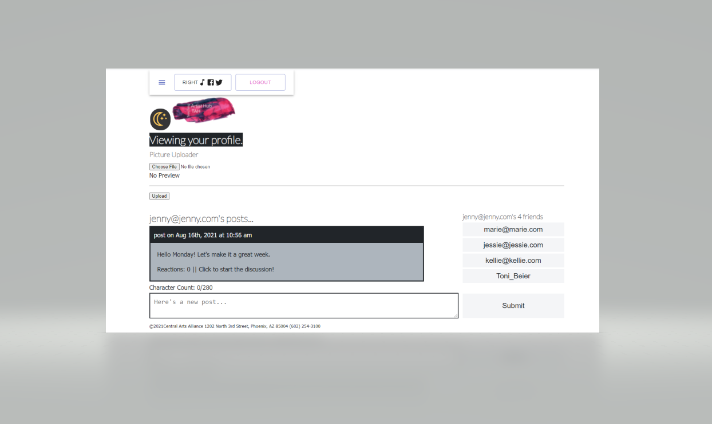

# Teaching-Artist-Hub

## Description
🔍Communications platform for non-profit arts organization.
    

## Built With

    
    
    
    
    
    
    
    
    
    
    
    
     
         
             
       
      
      
      
      
      
      
      
      
      

 
    
   

   
    

## User Story
As manager of an art studio, I need a professional and secure website that contracted teaching artists can log into to  view announcements, resources, and forms; communicate with each other via forum; upload documentation; view our social media feeds; and view a google calendar for the virtual class schedule. 

 
  

## Table of Contents
- [Description](#description)
- [Built With](#built-with)
- [User Story](#user-story)
- [Table of Contents](#table-of-contents)
- [Deployment](#deployment)
- [Screenshots](#screenshots)
- [Installing PWA](#progressive-web-app)
- [Testing](#testing)
- [Contribution](#contribution)
- [Questions](#questions)

 

## Deployment
https://teaching-artist-hub.herokuapp.com/

## Screenshots
  
  
  
  
  
  
  
  

## Progressive Web App
The Teaching Artist Hub has been designed as a progressive web app (PWA) and can be installed on most devices.  To install the TAH, complete the following steps:

### On iOS
* Visit the following link in the Safari app: https://teaching-artist-hub.herokuapp.com/
* Select the share icon on the toolbar
* Scroll down and select 'Add to Home Screen'
* Confirm by selecting 'Add'

### On Android
* Visit the following link in the Chrome app: https://teaching-artist-hub.herokuapp.com/
* Select the 'More' icon on the top bar (three dots icon)
* Select 'Add to Home Screen'
* Confirm by selecting 'Add'
* NOTE: Most Androids devices will automatically identify the link as a PWA and the user will be presented with the option to download the app.

### On Desktop
* Visit the following link in the Chrome or Edge app: https://teaching-artist-hub.herokuapp.com/
* Select the install button in the address bar
* Select 'Install'

 

 

## Testing
✏️ See deployed site to test functionality. 

  

 

## Contribution
This application was created by Lindsey Krause, Christi Mc, Joseph Porzaazo, Vanessa McGuire, and Kellie Werrell

 

## Questions
:telephone_receiver: Contact us with any questions: [email] 
 
(mailto: kelliewerrell@gmail.com, vmcguire6377@gmail.com, joeporazzo@gmail.com,  christileemc@gmail.com) 
 
 [GitHub Kellie Werrell](https://github.com/Kwerrell73), [GitHub Vanessa McGuire](https://github.com/vmcguire6377), [GitHub Christi Mc](https://github.com/Kwerrell73), [GitHub Joe P](https://github.com/noreaster24), [GitHub Lindsey Krause](https://github.com/LindseyKrause) 